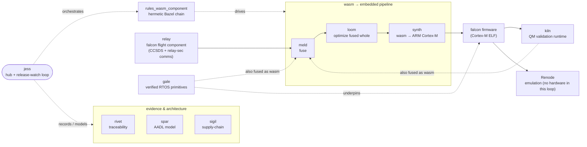
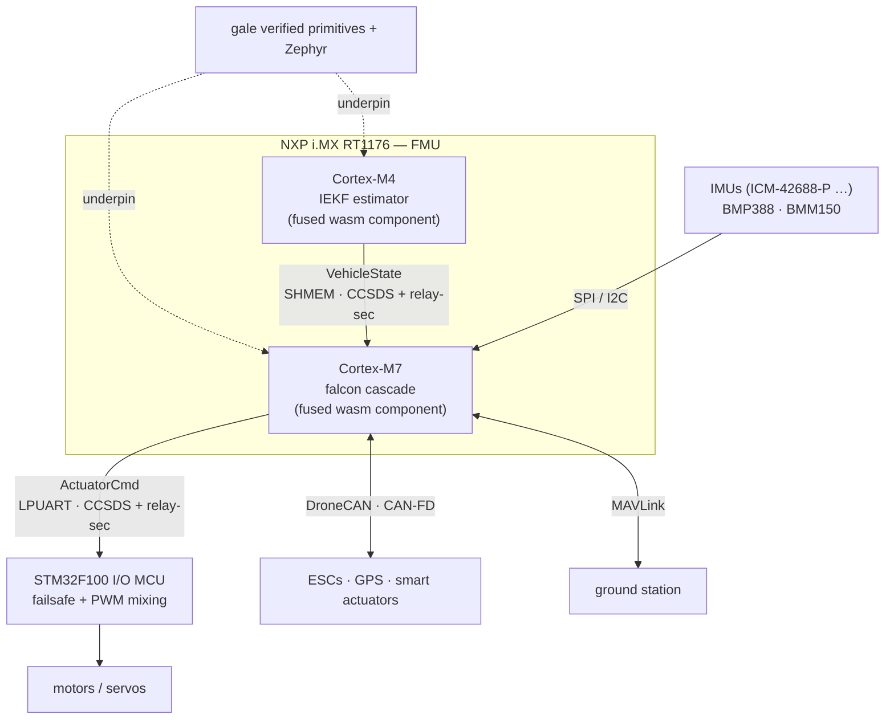

# jess

[](https://github.com/pulseengine/jess/actions/workflows/ci.yml)

*A jess is the falconry tether that holds the bird during training before free flight.*

The hardware-integration + release-watch hub that takes **falcon** (the
[relay](https://github.com/pulseengine/relay) flight stack) onto real hardware
through the [PulseEngine](https://github.com/pulseengine) wasm→embedded pipeline:
**meld** fuse → **loom** optimize → **synth** wasm→ARM → on **gale** verified
RTOS primitives, emulated/run via **rules_wasm_component** + Renode.

jess is not a code library — it is an **evidence-as-code** project: the
substance lives in [rivet](https://github.com/pulseengine/rivet) artifacts
(`artifacts/`) and a [spar](https://github.com/pulseengine/spar)/AADL hardware
model (`hardware/`), exercised by a hermetic Bazel firmware chain.

## Architecture (high level)

### How jess uses the PulseEngine repositories



### How it runs on the drone — Pixhawk 6X-RT (Phase 2, distributed)



Same WIT contract either way: components on one core are **meld-fused** (direct
calls); across cores/MCUs they speak **CCSDS Space Packets wrapped by relay-sec**
(counter + anti-replay + AEAD) over a shared-memory / LPUART transport — see
`DD-009`.

## Three phases

1. **HIL** against relay's simulation on gale's STM32F4 / Renode flight-control target.
2. **Real drone hardware** — Holybro **Pixhawk 6X-RT** (NXP i.MX RT1176; M7 + M4 + STM32F100 I/O), bench/tethered. See `DD-007`.
3. **A real flying drone** (DO-178C bridge added).

## The hermetic chain (Bazel)

Order is **meld → loom → synth**: fuse first, then loom optimizes the fused
whole (more than per-component), then synth emits ARM. In the maximal-wasm
direction (`DD-006`), gale + kiln are themselves compiled to wasm and fused in
here too, so loom optimizes the entire fused system.

```
@falcon_flight_wasm (sha256-pinned relay release asset)
  → adopt_wasm_component  (//:falcon-flight)
  → wasm_validate         (//:falcon-validate)
  → meld_fuse             (//:falcon-fused)        # fuse component(s) → one core module
  → wasm_optimize  [loom] (//:falcon-optimized)    # loom optimizes the fused whole
  → synth_compile [→ARM]  (//:falcon-firmware, cortex-m4f/m7)
```

```bash
bazel build //:falcon-validate //:falcon-optimized //:falcon-fused //:falcon-firmware
```

## Release-watch loop

jess runs a feedback loop over its upstream suppliers: poll each new release,
test every piece individually (the wasmtime SIL gate — `run-stabilization < 0.1
rad`, `run-position-hold < 0.6 m` — then meld→kiln differential, then
synth→Cortex-M), record results as rivet `ai-found-defect` artifacts, and feed
problems back upstream as respectful issues. Behavioral differential before
adoption is mandatory (see `docs/release-watch-runbook.md` §3a). Findings live in
`artifacts/findings.yaml`.

## Layout

| Path | What |
|---|---|
| `artifacts/` | rivet artifacts — requirements, design decisions, STPA, safety goals, findings |
| `hardware/pixhawk6x-rt.aadl` | spar/AADL multi-processor model of the Phase-2 target |
| `BUILD.bazel`, `MODULE.bazel` | the hermetic falcon firmware chain |
| `docs/release-watch-runbook.md` | the loop's operating procedure |
| `repro/` | committed reproductions attached to upstream issues |

## Verify

```bash
rivet validate                                   # the artifact spine
spar parse hardware/pixhawk6x-rt.aadl            # the hardware model
spar instance --root Pixhawk6XRT::Pixhawk6XRT.v2a hardware/pixhawk6x-rt.aadl
```

Part of the [PulseEngine](https://github.com/pulseengine) toolchain.
